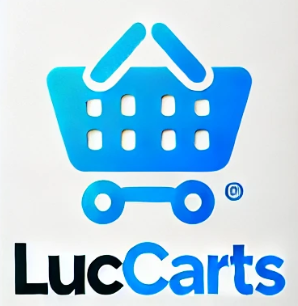
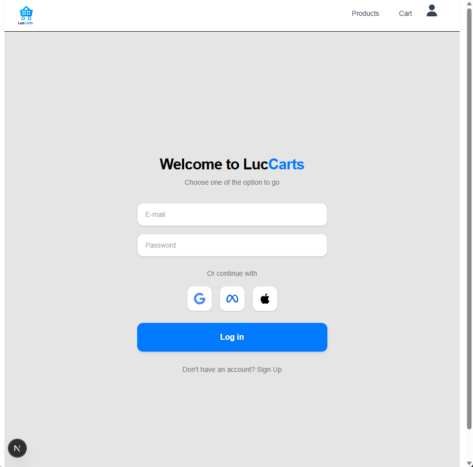

<p align="center">
  
</p>

<h1 align="center">LucCarts</h1>

<p align="center">
  <strong>Campus-Focused Grocery Delivery for the University of Oklahoma</strong>
</p>

<p align="center">
  <a href="#features">Features</a> •
  <a href="#tech-stack">Tech Stack</a> •
  <a href="#architecture">Architecture</a> •
  <a href="#getting-started">Getting Started</a> •
  <a href="#roadmap">Roadmap</a>
</p>

<p align="center">
  
  
  
  
  
  
</p>

---

## Overview

LucCarts is a modern, cloud-native grocery delivery web application designed specifically for student life. Inspired by Instacart, it connects students with local campus stores, delivering essentials directly to dorm doors — with real authentication, persistent carts, and durable order records.

<p align="center">
  
</p>

---

## Features

| Feature | Description |
|---|---|
| 🔐 **Secure Authentication** | Email/password auth via Supabase with session cookies and social login UI (Google, Meta, Apple) |
| 🛍️ **Live Product Catalog** | Server-rendered product grid fetched from cloud PostgreSQL in real time |
| 🛒 **Persistent Smart Cart** | Zustand-powered cart state that survives page reloads via `localStorage` |
| 💳 **Checkout & Orders** | Full checkout flow with tax computation, order creation, and durable records in the database |
| 🧾 **Printable Receipts** | Per-order receipt pages with browser print support |
| 📱 **Mobile-First Design** | Responsive layouts with touch-optimized interactions, PWA support, and safe-area insets |
| 🛡️ **Row Level Security** | Database-level access control — users can only view their own orders |
| 👤 **User Profiles** | Auto-provisioned profiles with database triggers on signup |

---

## Tech Stack

| Layer | Technology |
|---|---|
| **Framework** | Next.js 15 (App Router) |
| **UI** | React 19, Tailwind CSS v4, React Icons |
| **Language** | TypeScript |
| **State** | Zustand (with `persist` middleware) |
| **Database** | Supabase (PostgreSQL + Row Level Security) |
| **Auth** | Supabase Auth (email/password, social providers) |
| **Fonts** | Geist Sans & Geist Mono |
| **Deployment** | Cloud-ready (Vercel / any Node.js host) |

---

## Architecture

```text
┌──────────────────────────────────────────────────────────────────┐
│                          Browser (CSR)                           │
│  - Login via Supabase Auth                                       │
│  - Products grid (server-rendered from DB)                       │
│  - Cart state via Zustand → localStorage                         │
│  - Checkout creates order → Supabase database                    │
└───────────────▲───────────────────────────────────────────▲──────┘
                │                                           │
                │ Supabase Session                          │ localStorage
                │                                           │   (cart only)
┌───────────────┴───────────────────────────────────────────┴──────┐
│                      Next.js App Router                          │
│  - Pages: /login, /signup, /products, /checkout, /receipt, /profile
│  - Middleware guards protected routes via Supabase session        │
│  - Server/Client components where appropriate                    │
└───────────────────────────────┬──────────────────────────────────┘
                                │
                                │ Supabase Client SDK
                                │
┌───────────────────────────────▼──────────────────────────────────┐
│                       Supabase (Cloud)                           │
│  - PostgreSQL: products, orders, order_items, profiles           │
│  - Row Level Security (RLS) policies                             │
│  - Authentication & Session Management                           │
└──────────────────────────────────────────────────────────────────┘
```

> 📖 **Deep-dive:** See [`docs/Luccarts.md`](docs/Luccarts.md) for the full architecture & implementation guide — data models, routing, state management, security, and more.

---

## Project Structure

```text
web/
  src/
    app/
      layout.tsx              # Global shell (nav, metadata, PWA)
      globals.css             # Tailwind layers + mobile optimizations
      login/page.tsx          # Supabase email/password login
      signup/page.tsx         # Account registration
      products/page.tsx       # Server-rendered product grid
      checkout/page.tsx       # Cart UI + order summary + payment
      receipt/[id]/page.tsx   # Printable order receipt
      profile/page.tsx        # User profile page
      not-found.tsx           # 404 fallback
    components/
      ProductCard.tsx         # Reusable product card (client)
      MobileNavigation.tsx    # Responsive nav with mobile hamburger
      Icons.tsx               # SVG icon components
      PWAInstaller.tsx        # Progressive Web App installer
    lib/
      products.ts             # Product type definitions
      currency.ts             # USD formatting helper
      auth.ts                 # Auth utilities
    store/
      cart.ts                 # Zustand store (persistent cart)
    utils/supabase/
      client.ts               # Supabase client (browser)
      server.ts               # Supabase client (server components)
  middleware.ts               # Route protection via Supabase session
docs/
  Luccarts.md                 # Full architecture & implementation guide
  database_integration.md     # Database migration documentation
```

---

## Getting Started

### Prerequisites

- **Node.js** 18+
- **npm** (or pnpm / yarn)
- A [Supabase](https://supabase.com) project (free tier works)

### 1. Clone & Install

```bash
git clone https://github.com/lucm23/LucCarts.git
cd LucCarts/web
npm install
```

### 2. Configure Environment

Create `web/.env.local` with your Supabase credentials:

```env
NEXT_PUBLIC_SUPABASE_URL=https://your-project.supabase.co
NEXT_PUBLIC_SUPABASE_ANON_KEY=your-anon-key
```

### 3. Run

```bash
npm run dev
```

Open [http://localhost:3000](http://localhost:3000) — you'll land on the login page.

---

## Roadmap

- [x] Cloud-native backend (Supabase PostgreSQL)
- [x] Secure authentication (Supabase Auth)
- [x] Row Level Security policies
- [x] Persistent cart (Zustand + localStorage)
- [x] Order creation & durable records
- [x] Mobile-first responsive design
- [x] PWA support
- [ ] Migrate receipts from localStorage to database queries
- [ ] Order history page (`/orders`)
- [ ] OAuth providers (Google, GitHub)
- [ ] Admin dashboard (product & order management)
- [ ] Stripe integration for real payments
- [ ] Search & filtering with query params
- [ ] Image optimization & caching

---

## License

[MIT](LICENSE) — built for convenience, speed, and student life.
